# Financial Reporting and Analysis System using SQL

## Project Description

**Overview:**
The project aims to develop a comprehensive financial reporting and analysis system using SQL (Structured Query Language). The system utilizes five key datasets: general ledger, charts of accounts, territory, calendar, and cash flow. By leveraging these datasets, the system generates essential financial reports including Profit and Loss (P&L) statements, Balance Sheets, and Cash Flow statements.

## Project Goal

Design SQL queries to generate accurate and timely financial reports including Profit and Loss statements, Balance Sheets, and Cash Flow statements.

## Tools and Library Used

## Project Result

[Click here to get full code](SQLQuery_finance.sql)

### A. Profit and Loss Statement

**Create pivot table report of profit and loss for 2018, 2019, 2020**
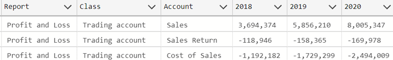

**If we compare SQL Query to Excel result**
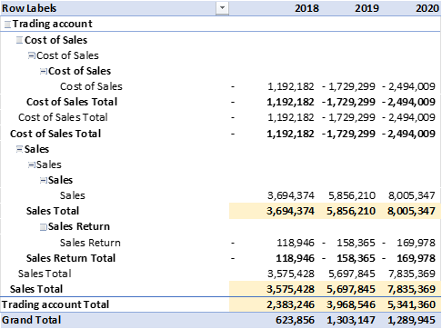

**Create pivot table report of profit and loss for 2018, 2019, 2020 for country France**
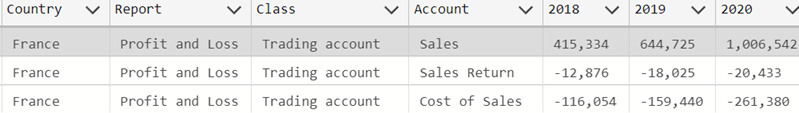

**If we compare SQL Query to Excel result for France only**
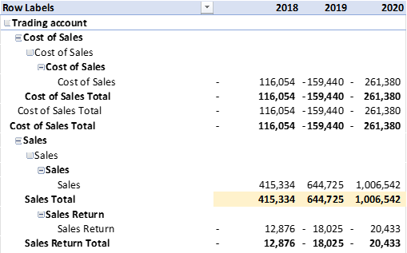

**Calculating Profit and Loss Statement Related Values**
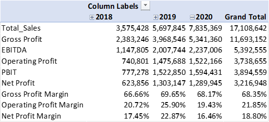

**If we compare SQL Query to Excel Profit and Loss Statement Related Values**

### B. Balance Sheet

**Create pivot table report of balance sheet for 2018, 2019, 2020**
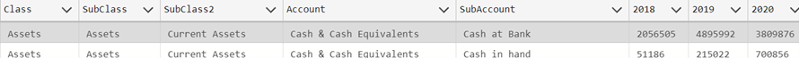

**If we compare SQL Query to Excel result**
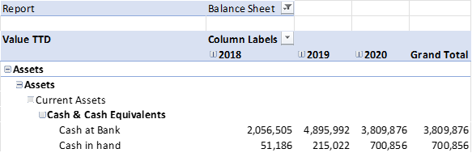

**Calculating Balance Sheet Related Values**
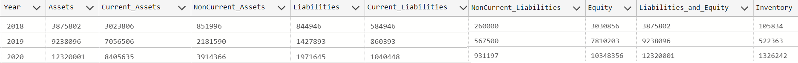

**If we compare SQL Query to Balance Sheet Excel result**
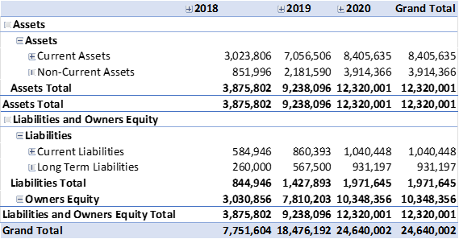

### C. Calculating Ratios

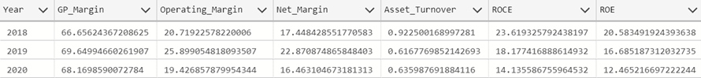
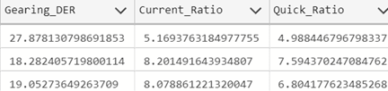
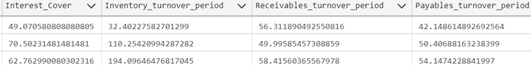

### D. Cash Flow Statement
**Calculating Cash Flow Related Values**
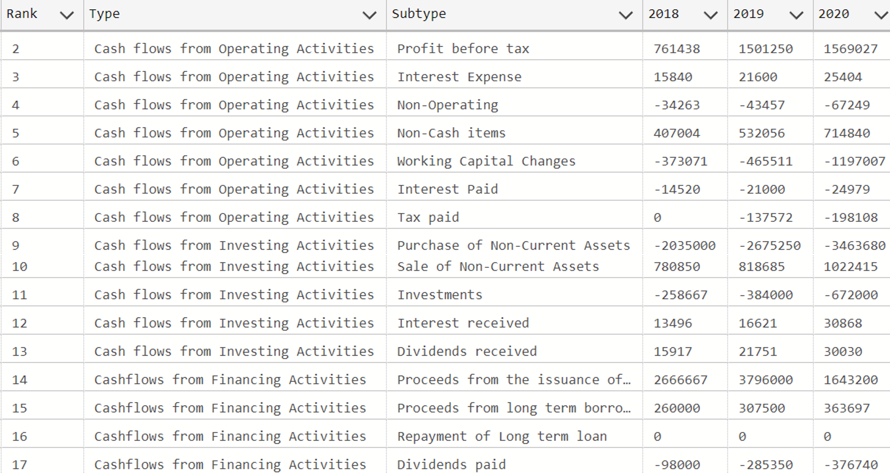

**If we compare SQL Query to Cash Flow Excel result**
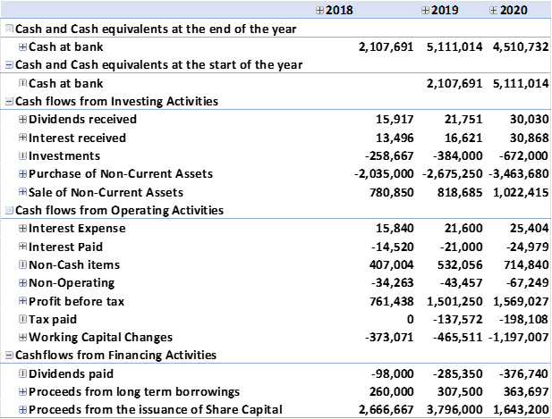

## Maintainer

Lavanya Tadisina is a Business Analyst with over 4 years of experience in delivering data-driven solutions and process optimization within financial services and enterprise IT environments. She specializes in SQL-based data analysis, KPI reporting, and stakeholder management to drive operational efficiency and informed business decisions.

Contact: tadisinalavanya@gmail.com